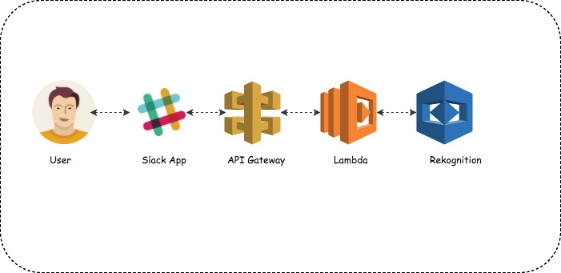
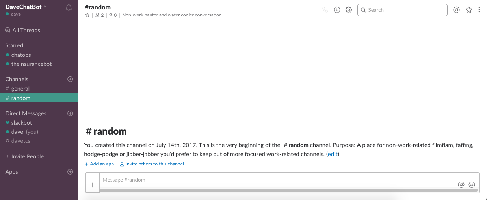
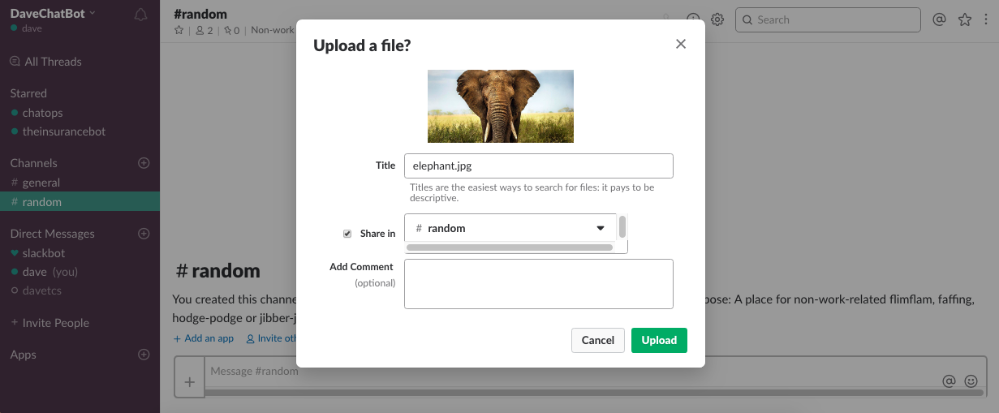
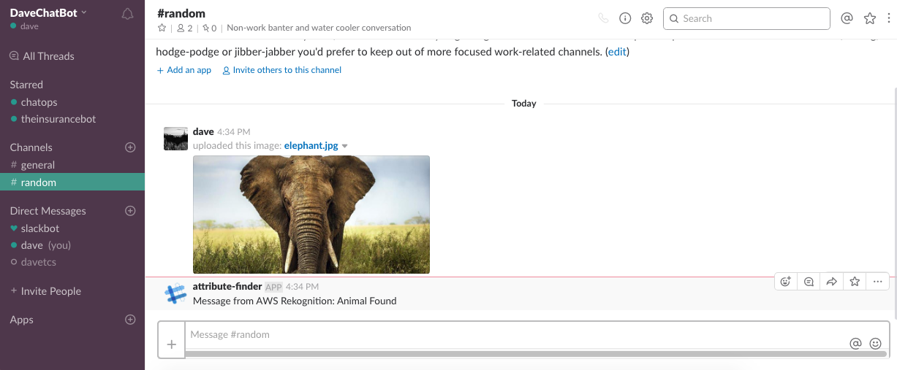
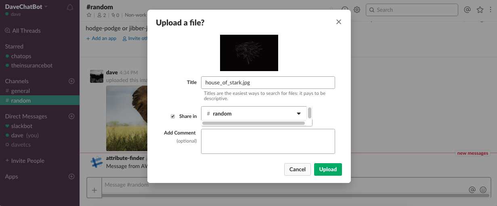
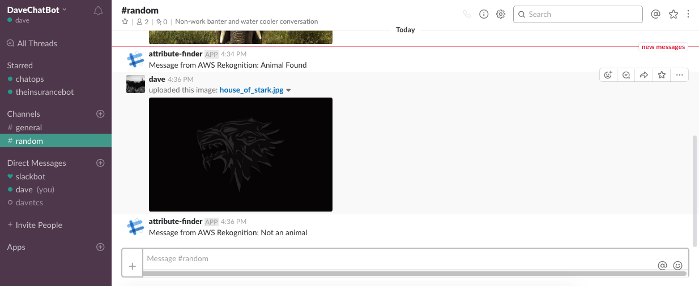

# Serverless Wildlife Finder

By leveraging this guide, you could build a [serverless](https://aws.amazon.com/serverless/#getstarted) wildlife detecting application integrated with [Slack](https://slack.com/).

The core functionality is based on [AWS ](https://aws.amazon.com/) and utilizes the following services.
1. [Amazon API Gateway](https://aws.amazon.com/api-gateway/)
1. [AWS Lambda](https://aws.amazon.com/lambda/)
1. [Amazon Rekognition](https://aws.amazon.com/rekognition/)
1. [AWS S3](https://aws.amazon.com/s3)
1. [AWS CloudFormation](https://aws.amazon.com/cloudformation/)

## Architecture

1. User uploads a message with the image in the Slack channel
1. Slack sends the message to an Amazon API Gateway API
1. The API triggers an invocation of the Lambda function
1. Amazon Rekognition scans the image and returns a list of detected labels
1. The list of labels is checked for wildlife tags
1. Response is posted to the chat channel

## Steps
### Create Slack App
1. Login to [Slack](https://slack.com/) and [create an app](https://api.slack.com/apps?new_app=1). Refer the [Documentation](https://api.slack.com/slack-apps#creating_apps) for assistance  
1. Click `Basic Information` tab under `Settings`. Write down the `Verification Token`
1. Go to `OAuth & Permissions` tab under `Features`
	1. Under `Permissions Scopes` section add the following permission scopes
		* files:read
		* files:write:user
		* chat:write:bot
		* channels:history
	1. Click `Save Changes`. Then click `Install App to Team` and then `Authorize`
	1. Write down the `OAuth Access Token`

### AWS Backend creation

AWS Cloudformation template is provided to facilitate the deployment. The resources are created in us-west-2 (Oregon). Click  button to create the services in your account. 

1. **PS: Use this [template](https://s3.amazonaws.com/dave-cloud-poc/Serverless-slack/wildlife_finder.serverless.yaml) if the above link doesn't work**
1. Give the AWS Cloudformation permission to `create IAM resources` and `create IAM resources with custom names`
1. Then click on `Create Change Set`
1. Finally click `Execute`

### Finalize Slack Event Subscription
1. Go to the Cloudformation stack created to note down the `RequestURL` under the `output` section
1. Return to Slack App settings page
	1. Navigate to `Event Subscriptions` tab under `Features` and enable events
	1. Navigate to `Request URL` field  and enter the `RequestURL` value 
	1. Click on `Add Team Event` and select `message.channels`. Click `Save Changes`

### Testing the Example
Now go to the Slack app and go to `#random` channel. Upload an image and you would find your app identifying animals in it. 

## Cleaning Up 

To remove all resources created by this example, do the following:

1. Delete the CloudFormation stack.
1. Delete the CloudWatch log groups associated with each Lambda function created by the CloudFormation stack.

## Services

### CloudFormation Stack
* A Stack named **WildlifeFinder** is first created 

### AWS Lambda

1. **Function** - WildlifeFinder
	- Function to validate slack event messages and check images
1. **Permission** - WildlifeFinderFunctionWildlifeFinderAPIPostPermissionTest
	- Allows API Gateway Test stage to call Lambda function
1. **Permission** - WildlifeFinderFunctionWildlifeFinderAPIPostPermissionProd
	- Allows API Gateway Prod stage to call Lambda function

### AWS IAM
* **LambdaRekognitionRole** - IAM Role with policy that allows Lambda function to invoke "rekognition:DetectLabels" API call and write log messages to CloudWatch Logs.

### Amazon API Gateway
1. **WildlifeFinderAPI:** - API for wildlife finder app
1. **WildlifeFinderAPIProdStage** - Implicitly created production stage for API
1. **WildlifeFinderAPIDeploymentXXXXXXXXX** - Implicitly created deployment for production stage of API

## References 
[Image Recognition and Processing Serverless reference](https://github.com/awslabs/lambda-refarch-imagerecognition)
